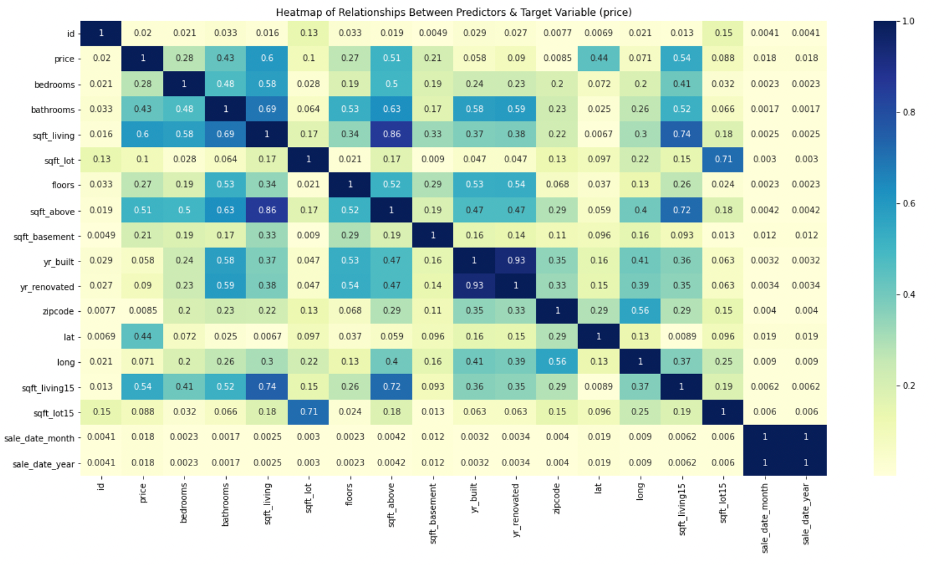
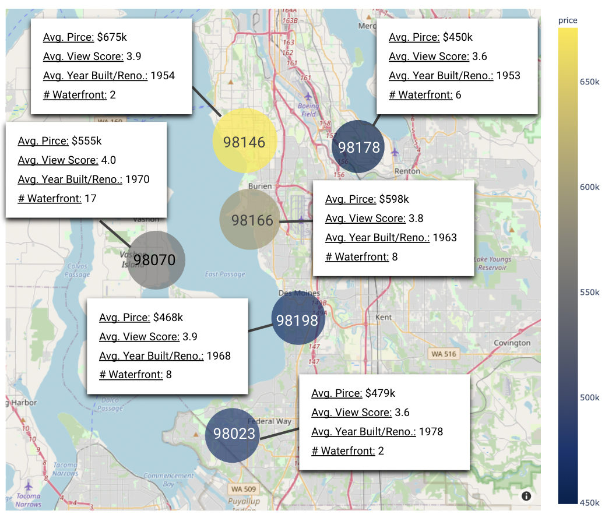

# King County Housing Prices Analysis

## Project Overview

This proposal seeks to provide the stakeholder, a young-adult couple, with recommended zip codes to purchase their next vacation home. The below project will utilize several linear regression models. Each model will take steps to minimize error and analyze which variables from the provided data set most influence a home’s price. 

## Data and Business Problem

The data utilized encompasses home sales between 2014 and 2015 in King County, Washington. In its raw form, the data set includes about 2200 rows of data entries and about 20 columns of variables.

The stakeholder would like their next home to be within their budget of $1 million, have no more than 4 bedrooms, and would like their home to be a waterfront property with a nice view. With the use of linear regression modeling, we will ultimately provide a recommendation on the locations within King County the stakeholder should most focus on when purchasing this vacation home. As later mentioned in the notebook, based on the stakeholder’s criteria, the homes the stakeholder will be considering will be relatively older in terms of age (1950s – 1980s build). Ultimately, it will be important for the stakeholder to target homes below their budget as they will likely need to invest in home improvement projects.

## Modeling

For the model process, we began with a baseline model. The baseline model only modeled the property square footage against our target variable, price. The model is utilizing square footage as our first and only variable since this was  identified as the strongest coefficient against price by the heat map above. The second model included all of the data set's variables (with the exception of our target variable, 'price'). The model also scaled any numeric variables and encode the ordinal and nominal variables. This resulted in a root mean squared error of $143,610, a mean absolute error of $112,585, and an adjusted r-squared of 45.0%. The third model made further adjustments to the variables with goal of further minimizing our error metrics. This third model included all of the data set's variables (with the exception of ther target variable, 'price') but now treated the zip code variable as a nominal variable and 'hot encoded' it to create separate columns for each zip code. As a result, the third model's root mean squared error was $85,627, the mean absolute error was $60,168, and the adjusted r-squared was 82.0%. After two additional iterations, the fifth model's ultimate root mean squared error was $87,751, the mean absolute error waws $61,876, and the adjusted r-squared is 81.0%.

### Regression Results

Given the fourth and fifth models resulted in slightly higher in error, the best model to utilize when predicting sale price would be the third model. The third model utilized all variables (with the exception of our target variable, 'price'), scaled any numeric variables and encoded the ordinal and nominal variables. Additionally, the zip code variable was treated as a nominal variable and 'hot encode' it to create separate columns for each zip code. As a reminder, the third model resulted in a root mean squared error of $85,627, a mean absolute error of $60,168, and an adjusted r-squared was 82.0%. 

## Conclusion

This analysis leads to three recommended zip codes the stakeholder should consider purchasing their vacation home in:

* **ZIP Code 98070:** Given the properties within the requirements and budget of the stakeholder are typically older (either renovated or built between 1950 – 1980) it is recommended the stakeholder target homes that fall in the middle of their $1.0 million budget. With the average selling price in the 98070 ZIP code being ~$555k, there will be plenty of leftover funds for the stakeholder to invest in any upgrades to their home. ZIP code 98070 is located on Vashon Island which known for its waterfront homes and therefor is ideal for a vacation home.

* **ZIP Code 98198:** In the event the stakeholder does not want a home on Vashon Island, ZIP code 98198 also reports average home prices well below their budget of $1 million at average sale prices of ~$468k. This allows for enough funds for the stakeholder to invest in any improvements the average year built for waterfront homes in this ZIP code is 1968.

* **ZIP Code 98178:** Similar to ZIP codes 98070 and 98198, ZIP code 98178 reports an average home sales price of ~$450k and an average year built or renovated of 1953. This ZIP code offers the least amount of waterfront homes in terms of volume but is the most proximate to Seattle

### Nex Steps

Further criteria and analyses could yield additional insights to further inform the stakeholder in terms of where to purchase their vacation home:

* **Consider non-waterfront homes.** The stakeholder should consider whether or not a waterfront home is absolutely necessary for their vacation home. With more time, including  homes that are not waterfront but still proximate to water may increase home options substantially and as a result allow for other locations and/or newer properties to be considered. 

* **Specify ideal square footage.** Based on the regression models preformed throughout this notebook, it is clear that the square footage has a significant relationship with a property’s price. If the stakeholder would provide parameters regarding their ideal home square footage an estimate on average price would be more accurate.

* **Utilize more recent sales data.**  The analyses and recommendations presented throughout this notebook are based off of the King County data set. The data set only contains homes that were sold between 2014 and 2015. Given the ever-changing nature of the real estate industry, especially after COVID-19, it would be helpful with more time to review a data set that contains more recent sales.

## Repository Structure
├── code
│   ├── data_cleaning.py
│   ├── feature_engineering.py
│   └── visualizations.py
│   ├── data_preparation.py
│   ├── visualizations.py
│   └── King County Housing Prices Analysis.ipynb
├── data
├── Images